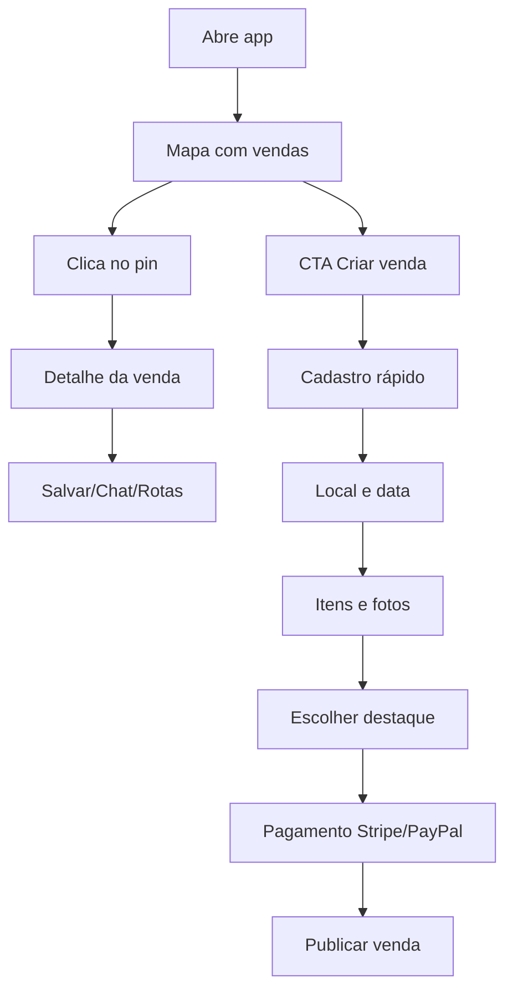

# GarageSale Madrid — Wireframe, UX Flows e Telas (Mobile)

Este documento descreve o wireframe completo, fluxos UX e telas detalhadas para o app “GarageSale Madrid”, além de arquitetura de backend e integrações de pagamento e geolocalização.

## 1) Visão Geral do Produto
**Objetivo**: conectar vendedores de itens usados em Madrid com compradores locais, priorizando rapidez, proximidade e confiança.

**Público-alvo**
- Vendedores: querem publicar vendas rápidas de móveis, roupas, eletrônicos e itens domésticos.
- Compradores: buscam oportunidades próximas e visitas rápidas.

**Princípios de design**
- Rápido, direto ao ponto, com foco no mapa.
- Alto contraste nos pins por categoria.
- Fluxos curtos e fáceis de repetir.

---

## 2) Mapa de Informação (IA)
- **Mapa**
  - Pins por categoria
  - Card de venda selecionada
  - Filtros rápidos
  - CTA “Criar venda”
- **Lista**
  - Lista filtrada
  - Ordenação por distância/preço
- **Detalhe da venda**
  - Fotos, descrição, itens principais
  - Local aproximado, data e horário
  - Botões: “Salvar”, “Compartilhar”, “Chat”
- **Criar venda**
  - Cadastro rápido
  - Endereço aproximado + data/hora
  - Upload fotos
  - Categoria, preço, descrição
  - Opção de destaque (Stripe/PayPal)
- **Perfil**
  - Vendas publicadas
  - Compras
  - Avaliações e reputação
- **Notificações**
  - Vendas próximas
  - Vendas destacadas
  - Lembretes
- **Gamificação**
  - Ranking
  - Pontos
  - Recompensas

---

## 3) Fluxos UX (end-to-end)

### Fluxo 1: Explorar e visitar venda
1. Home (Mapa) abre com vendas próximas.
2. Usuário toca em um pin.
3. Abre Card resumo da venda.
4. Abre Detalhe da venda.
5. Usuário escolhe “Salvar”, “Chat” ou “Rotas”.

### Fluxo 2: Criar venda gratuita
1. CTA “Criar venda” no mapa.
2. Cadastro rápido (nome, email, telefone).
3. Endereço aproximado + data/hora.
4. Upload fotos + categorias + descrição curta.
5. Publicar venda (gratuita).
6. Confirmação e preview no mapa.

### Fluxo 3: Criar venda destacada (pagamento)
1. Mesmo fluxo anterior.
2. Tela de destaque (3€–10€).
3. Escolhe Stripe ou PayPal.
4. Pagamento rápido.
5. Venda destacada aparece no topo do mapa e notificação.

### Fluxo 4: Busca + filtros
1. Usuário abre filtros.
2. Define categoria, preço, proximidade, data.
3. Aplica e vê no mapa ou lista.
4. Ordena por distância ou preço.

### Fluxo 5: Perfil e reputação
1. Usuário acessa perfil.
2. Visualiza histórico de vendas e compras.
3. Avalia vendedores/compradores.
4. Vê pontuação e ranking.

---

## 4) Wireframes (texto/estrutura)

### 4.1 Home — Mapa
```
[Header]
  GarageSale Madrid    [🔍 Busca] [⚙️ Filtros]

[Mapa] (Google Maps / Mapbox)
  Pins coloridos por categoria
  Pin destacado em tamanho maior

[Card Flutuante - Venda selecionada]
  Foto  | Título
  Categoria | Preço | Distância
  Data/Hora
  [Ver detalhes]

[Bottom Bar]
  [Mapa] [Lista] [Criar venda] [Notificações] [Perfil]
```

### 4.2 Lista de vendas
```
[Header]
  Lista de vendas   [Ordenar: Distância]

[Cards]
  Foto | Título | Preço
  Categoria | Distância | Data

[Bottom Bar]
  [Mapa] [Lista] [Criar venda] [Notificações] [Perfil]
```

### 4.3 Detalhe da venda
```
[Header]
  < Voltar

[Carrossel de fotos]

[Título + Categoria + Preço]
[Descrição curta]
[Local aproximado + Data/Hora]

[Botões]
  [Salvar] [Chat] [Rotas]

[Seção Itens]
  Lista com miniaturas
```

### 4.4 Criar venda — Passo 1 (Cadastro)
```
[Header] Criar venda (1/4)

Nome
Email
Telefone

[Continuar]
```

### 4.5 Criar venda — Passo 2 (Local + Data)
```
[Header] Criar venda (2/4)

Endereço aproximado (mapa + autocomplete)
Data da venda
Hora da venda

[Continuar]
```

### 4.6 Criar venda — Passo 3 (Itens e Fotos)
```
[Header] Criar venda (3/4)

Upload fotos (grid)
Categoria (móveis/roupas/etc)
Descrição curta
Preço ou faixa de preço

[Continuar]
```

### 4.7 Criar venda — Passo 4 (Destaque)
```
[Header] Criar venda (4/4)

Venda gratuita
  - aparece no mapa

Venda destacada
  - aparece no topo
  - notificações enviadas
  Preço: 3€ / 5€ / 10€

[Stripe] [PayPal]
[Publicar]
```

### 4.8 Perfil
```
[Header]
  Meu perfil

[Resumo]
  Avaliação média
  Pontos
  Ranking

[Tabs]
  Vendas publicadas | Compras | Avaliações
```

### 4.9 Notificações
```
[Header]
  Notificações

[Lista]
  - Venda destacada a 1km
  - Lembrete: venda às 15h
  - Nova venda perto de você
```

### 4.10 Ranking
```
[Header]
  Ranking semanal

[List]
  1. @userA - 120 pts
  2. @userB - 100 pts
```

---

## 5) Telas Detalhadas (componentes)

### Home (Mapa)
- **Header**: logo + busca + filtros.
- **Mapa**: pins coloridos por categoria.
- **Card resumo**: foto, título, distância, preço.
- **CTA Criar venda** fixo.

### Detalhe da venda
- **Galeria** com fotos grandes.
- **Resumo**: categoria, preço, descrição.
- **Ações**: salvar, compartilhar, chat, rotas.

### Criar venda
- **Stepper**: 4 etapas.
- **Uploads** com compressão e preview.
- **Localização** com autocomplete.
- **Pagamento** Stripe/PayPal opcional.

### Perfil
- **Reputação**: nota média, comentários.
- **Histórico**: vendas e compras.

### Notificações
- **Switches**: alertas próximos, destaques.

---

## 6) Backend e Integrações

### 6.1 Arquitetura
- **Mobile**: Flutter ou React Native.
- **API**: Node.js (NestJS/Express) ou .NET Core.
- **DB**: PostgreSQL (relacional) ou Firebase (rápido).
- **Maps**: Google Maps API ou Mapbox.
- **Pagamentos**: Stripe e PayPal.

### 6.2 Principais entidades (PostgreSQL)
- **User**: id, nome, email, telefone, rating, pontos.
- **Sale**: id, user_id, título, descrição, categoria, preço, localização (lat/lng), data/hora, is_featured, status.
- **SalePhoto**: id, sale_id, url.
- **Purchase**: id, buyer_id, sale_id, status.
- **Review**: id, reviewer_id, reviewee_id, score, comentário.
- **Notification**: id, user_id, tipo, payload.
- **Payment**: id, sale_id, provider, amount, status, provider_ref.

### 6.3 Endpoints principais (REST)
- `POST /auth/register`
- `POST /auth/login`
- `GET /sales?category=&price=&distance=&date=`
- `POST /sales` (criação)
- `GET /sales/:id`
- `POST /sales/:id/feature` (destaque)
- `POST /payments/stripe`
- `POST /payments/paypal`
- `GET /users/me`
- `GET /users/me/sales`
- `GET /users/me/purchases`
- `POST /reviews`
- `GET /ranking`

### 6.4 Integração Geolocalização
- **Frontend**: GPS para posição do usuário.
- **Backend**: consulta por raio (PostGIS ou fórmula Haversine).
- **Pins**: cores por categoria.

### 6.5 Integração Pagamentos
- **Stripe**: Checkout session para destaque.
- **PayPal**: Order + capture.
- **Webhook**: confirmar pagamento e ativar destaque.

---

## 7) Notificações
- **Push** (Firebase Cloud Messaging / APNs).
- Triggers:
  - Venda próxima (raio 1–5km).
  - Venda destacada.
  - Lembrete no horário.

---

## 8) Gamificação
- **Pontos**: +10 por venda concluída.
- **Ranking semanal**: top 10.
- **Recompensas**: badges, destaque grátis.

---

## 9) Extras (Opcional)
- Compartilhar venda em redes sociais.
- Chat rápido comprador/vendedor.
- Roteiro otimizado para visitar várias vendas.

---

## 10) Mermaid — Fluxo Principal


---

## 11) Próximos Passos de Implementação
1. Definir stack final (Flutter vs React Native).
2. Configurar banco e schema.
3. Criar MVP: mapa + criação de venda + busca.
4. Integrar pagamentos e notificações.
5. Adicionar gamificação e ranking.

